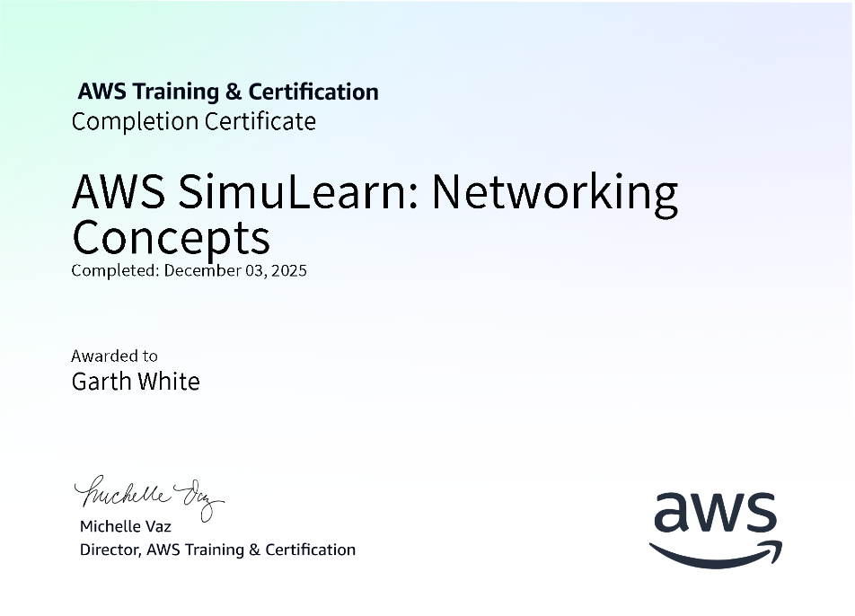
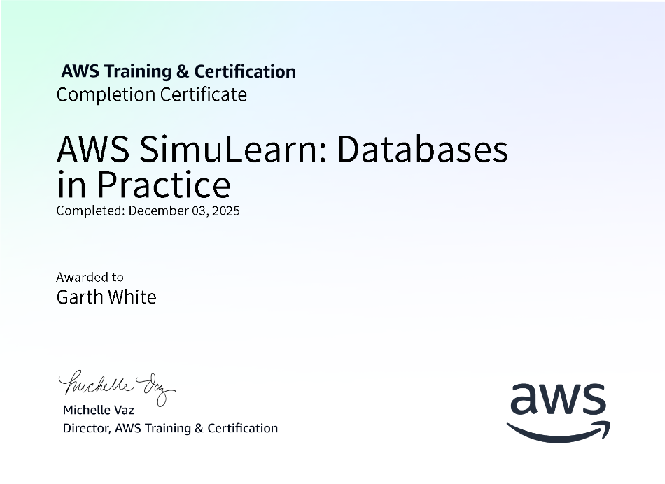

# Technical Certifications and Validations

This directory contains the official certifications and digital badges I earned during the AWS re/Start program. These credentials represent a comprehensive validation of my ability to design, secure, and manage professional-grade cloud infrastructure.

As a collective, these certifications prove my proficiency in the four core pillars of cloud engineering: **Networking**, **Security**, **Storage**, and **Database Management**.

---

## Core Certifications

### Networking Concepts
Demonstrates expertise in architecting Virtual Private Clouds (VPC), managing subnets, gateways, and route tables to ensure secure and efficient traffic flow.
* **Skills gained:** CIDR block management, connectivity troubleshooting, and network isolation.
* [View Certificate PDF](pdf/NetworkingConcepts.pdf)

---

### Core Security Concepts
Validates my understanding of the AWS Shared Responsibility Model and the implementation of robust identity and access management.
* **Skills gained:** IAM user/role/policy creation, least-privilege access control, and infrastructure auditing.
* [View Certificate PDF](pdf/CoreSecurityConcepts.pdf)

---

### Databases in Practice
Covers the deployment and scaling of managed database solutions to meet high-demand application requirements.
* **Skills gained:** RDS Multi-AZ deployments, read replicas for performance optimization, and database security.
* [View Certificate PDF](pdf/DatabasesinPractice.pdf)

---

### File Systems in the Cloud
Focuses on scalable, centralized storage solutions for distributed cloud applications.
* **Skills gained:** Amazon EFS configuration, cross-instance file sharing, and high-performance storage management.
* [View Certificate PDF](pdf/FileSystemintheCloud.pdf)

---

## How I Apply These Skills
These certifications are not just decorative; they are the foundation of the work found in my [Projects](../project/) directory. 
* I use my **Networking** knowledge to build the backbone of the 3D E-Commerce platform.
* I apply **Security** concepts to protect every endpoint I deploy.
* I utilize **Database and File System** expertise to ensure data is persistent, available, and fast.
