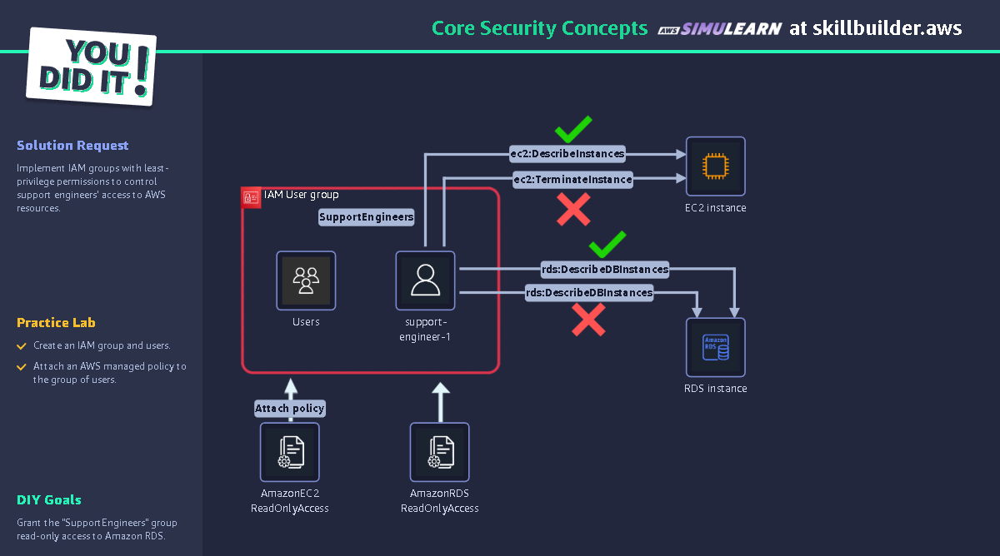
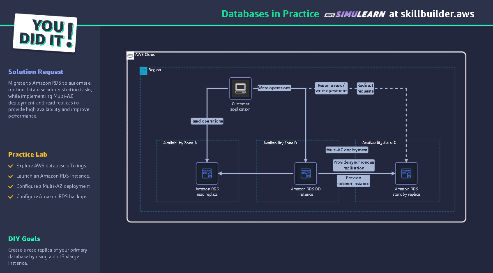
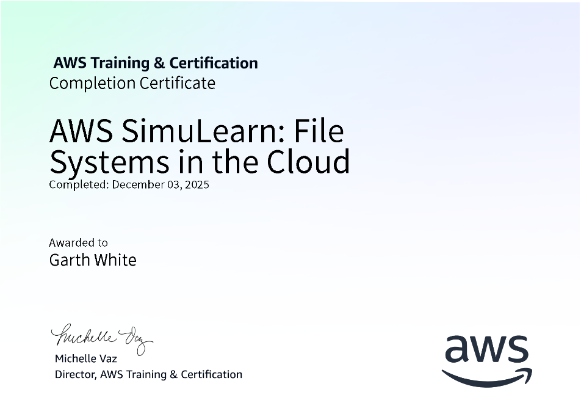
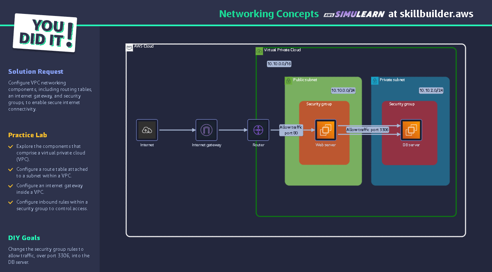

# AWS Restart Program

This is to track and document the inner workings of the AWS ReStart program. I will be going into detail on performing what to me are the basics of what is needed to know. 
Along with this we have also been asked to perform AWS Cloud Quest missions to attain the below:

## Directory
Labs, I will be showing each individual Lab as I found them, for reference it will be easier to go to and see the information if i label them out like that. 

Summary, is basically just the over view of the course.

### Projects are projects given in the course to complete. 
So far we have had one project
We have had to create a website for a struggling restaurant, that was struggling with demand planning and operational infrastructure problems. 
We used the following services from AWS to complete the tasks
1. S3 to host a static website
2. DynamoDB to connect a back end to track and book sign ups, orders and bookings
3. Lambda to connect the website to the database via functions 

# Certifications 

We have had the opportunity and request to complete the below certifiations to further our progress beyond the Re-Start course

## Core Security Concepts

### Objectives

- Compare IAM users, roles, and groups and their creation processes.
- Analyze the structure and components of IAM policies.
- Explain the AWS Shared Responsibility Model and compliance programs.
- Implement IAM best practices for secure access management.

### AWS Services

- Amazon Elastic Compute Cloud
- AWS Identity and Access Management
- Amazon Relational Database Service

https://github.com/GAWdessey/ReStart/blob/main/Certificates/CoreSecurityConcepts.pdf

## Databases in Practice

### Objectives

- Compare database types and their use cases on AWS.
- Implement Multi-AZ deployments for Amazon RDS high availability.
- Configure Amazon RDS read replicas for performance optimization.
- Differentiate between managed and hosted database solutions.
- Evaluate database migration strategies by using AWS DMS.

### AWS Services

- Amazon Relational Database Service

https://github.com/GAWdessey/ReStart/blob/main/Certificates/DatabasesinPractice.pdf

## File Systems in the Cloud

### Objectives

- Evaluate different storage options available on AWS.
- Analyze the key features and benefits of Amazon EFS.
- Apply Amazon EFS solutions to specific business scenarios.
- Configure Amazon EFS endpoints for centralized storage access.

### AWS Services

- Amazon Elastic Compute Cloud
- Amazon Elastic File System

https://github.com/GAWdessey/ReStart/blob/main/Certificates/FileSystemsintheCloud.pdf

## Networking Concepts

### Objectives

- Analyze key components of VPCs, subnets, internet gateways, and route tables.
- Evaluate the advantages of VPC implementations.
- Apply CIDR block notation and IP addressing concepts.
- Configure VPC traffic routing by using gateways, NACLs, and security groups.

### AWS Services

- Amazon Elastic Compute Cloud
- Amazon VPC

https://github.com/GAWdessey/ReStart/blob/main/Certificates/NetworkingConcepts.pdf

