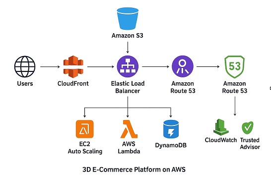

# AWS re/Start Program Portfolio: Cloud Engineering Journey

Welcome to my professional portfolio. This repository documents my intensive journey through the **AWS re/Start program**, featuring hands-on labs, architectural designs, and industry-recognized certifications. 

My goal is to demonstrate a deep understanding of cloud infrastructure, security best practices, and the technical agility to solve real-world business challenges using AWS.

---

## Technical Skills & Tools
* **Compute:** EC2 (Auto Scaling, Load Balancing), AWS Lambda (Serverless).
* **Storage & Content Delivery:** Amazon S3, Amazon CloudFront (CDN), Amazon EFS.
* **Databases:** Amazon RDS (Relational), Amazon DynamoDB (NoSQL).
* **Networking:** VPC, Route 53, Security Groups, Subnets, Gateways.
* **Security & Monitoring:** IAM, AWS WAF, AWS Shield, CloudWatch, Trusted Advisor.

---

## Featured Projects

### Project 1: Restaurant Website & Operational Backend
**Objective:** Modernize a restaurant's digital presence and demand planning through scalable cloud infrastructure.
* **Stack:** S3 (Static Hosting), DynamoDB (Inventory/Orders), Lambda (Serverless Backend).
* **Impact:** Built a fully integrated backend to track real-time bookings and orders, significantly reducing manual operational overhead through serverless automation.

### Project 2: 3D E-Commerce Platform Architecture
**Objective:** Design a globally available, highly scalable, and cost-efficient infrastructure to support 3D model rendering for millions of users.

* **Scalability:** Implemented **EC2 Auto Scaling** and **AWS Lambda** to handle unpredictable traffic spikes while optimizing costs.
* **Performance:** Leveraged **Amazon CloudFront** to reduce latency for heavy 3D assets and textures globally.
* **Database Strategy:** Utilized a hybrid approach with **RDS** for transactional consistency and **DynamoDB** for high-speed product browsing.
* **Security & Optimization:** Integrated **AWS WAF** for edge security and **Trusted Advisor** to ensure a cost-optimized, secure deployment.

---

## Certifications & Achievements

### Professional Badges
| Generative AI | Cloud Practitioner |
| :---: | :---: |
|  |  |
| *Foundational AI concepts and practical applications on AWS.* | *Comprehensive understanding of AWS cloud fundamentals.* |

### Technical Competencies
* **Networking Concepts:** Design and implementation of VPCs, subnets, and traffic routing.
* **Core Security Concepts:** Mastery of IAM roles, AWS Shared Responsibility Model, and access controls.
* **Databases in Practice:** Deployment of Multi-AZ RDS, Read Replicas, and migration strategies.
* **File Systems:** Configuration of centralized storage solutions using Amazon EFS.

---

## Repository Structure
- **[Labs/](./Labs/)** – Documented walkthroughs of technical exercises and key learnings.
- **[Projects/](./project/)** – End-to-end architectural solutions and implementation details.
- **[Certificates/](./Certificates/)** – Proof of technical proficiency and curriculum completion.
- **[Summary/](./summary.md)** – Reflections on growth and evolving cloud expertise.

---

## Connect with Me
I am actively seeking opportunities to contribute to cloud-forward teams as a Cloud Practitioner or Junior Cloud Engineer.
- **What I Did:** Architected production-ready environments.
- **What I Learned:** Security-first design, Cost Optimization, and Global Scalability.
- **What I Can Do:** Deploy, manage, and optimize resilient AWS infrastructures.
