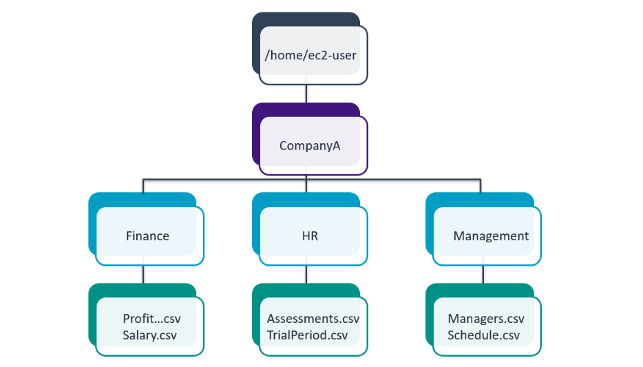
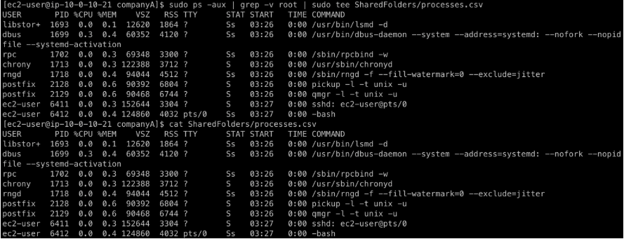
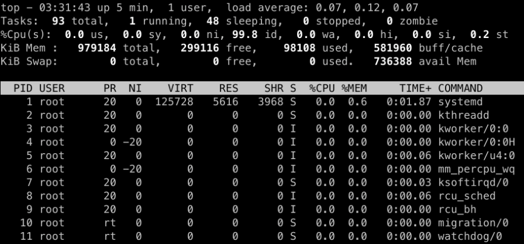

# Linux - 43 modules

Linux is an operating system that is similar to Unix. It is free and open source, and users can expand it.
A Linux distribution combines the Linux kernel with other software applications to provide a complete operating system environment.
All Linux distributions come with a CLI. Some also offer a GUI.
The bashshell is the default shell in Linux.
You can use the man command to read the Linux manual pages.

## Lab 1 

This is just an introduction to Linux CLI using Putty to connect to an EC2 

### Connecting to Putty ussing the SSH

### Running Commands

### Creating a script to make workflow easier

## Lab 2 - Managing Users and Groups

### Create Users
In this section, you create users based on the following table:

First Name	Last Name	User ID	Job Role	Starting Password
Alejandro	Rosalez	arosalez	Sales Manager	P@ssword1234!
Efua	Owusu	eowusu	Shipping	P@ssword1234!
Jane	Doe	jdoe	Shipping	P@ssword1234!
Li	Juan	ljuan	HR Manager	P@ssword1234!
Mary	Major	mmajor	Finance Manager	P@ssword1234!
Mateo	Jackson	mjackson	CEO	P@ssword1234!
Nikki	Wolf	nwolf	Sales Representative	P@ssword1234!
Paulo	Santos	psantos	Shipping	P@ssword1234!
Sofia	Martinez	smartinez	HR Specialist	P@ssword1234!
Saanvi	Sarkar	ssarkar	Finance Specialist	P@ssword1234!
Ensure that you are spelling the user IDs correctly so that these users can use default credentials to log in.

### Create Groups
In this section you create groups of users and add users to the groups.

Sales
HR
Finance
Personnel
CEO
Shipping
Managers

### Assign Users to the groups created 

To check the group memberships, enter sudo cat /etc/group into the terminal and press Enter.

Sales:x:1014:arosalez,nwolf,ec2-user
HR:x:1015:ljuan,smartinez,ec2-user
Finance:x:1016:mmajor,ssarkar,ec2-user
Shipping:x:1017:eowusu,jdoe,psantos,ec2-user
Managers:x:1018:arosalez,ljuan,mmajor,ec2-user
CEO:x:1019:mjackson,ec2-user

## Lab 3
### Creating a File
In this task, you create a specific folder structure. A picture of the files and folders is provided, and your task is to recreate the structure in the new machine.

Using the terminal, you recreate the following structure on the Linux machine.

/home/ec2-user/CompanyA/
/home/ec2-user/CompanyA/Finance/
/home/ec2-user/CompanyA/Finance/ProfitAndLossStatements.csv
/home/ec2-user/CompanyA/Finance/Salary.csv
/home/ec2-user/CompanyA/HR/
/home/ec2-user/CompanyA/HR/Assessments.csvv
/home/ec2-user/CompanyA/HR/TrialPeriod.csv
/home/ec2-user/CompanyA/Management/
/home/ec2-user/CompanyA/Management/Managers.csv
/home/ec2-user/CompanyA/Management/Schedule.csv

For this next task, you:

Copy the Finance folder and its content to the HR folder, and remove the previous Finance folder 
Move the Management folder inside the HR folder
Create an Employees folder inside the HR folder, and move the Assessments.csv and TrialPeriod.csv file inside the Employees folder
To ensure that you are in the appropriate CompanyA folder, enter pwd into the terminal and press Enter.

### Deleting and reorganizing

[ec2-user@ CompanyA]$ pwd
/home/ec2-user/CompanyA
To copy the Finance folder and its content, enter cp -r Finance HR and press Enter.

To verify that the folder and the content was copied, enter ls HR/Finance and press Enter.

[ec2-user@ CompanyA]$ ls HR/Finance
ProfitAndLossStatements.csv Salary.csv
To remove the Finance folder from the CompanyA folder structure, enter rmdir Finance and press Enter. 

[ec2-user@ companyA]$ rmdir Finance
rmdir: failed to remove ‘Finance/’: Directory not empty
Note:
rmdir works only on an empty directory.
To remove the folder, you have two options:

Remove the files inside the folder and then remove the Finance folder.
Use the rm command with the -r option to recursively delete the folder and its content.
To remove the files inside the Finance folder, enter rm Finance/ProfitAndLossStatements.csv Finance/Salary.csv and press Enter.

To verify that the folder is empty, enter ls Finance and press Enter.

[ec2-user@ CompanyA]$ ls Finance
[ec2-user@ CompanyA]$
To remove the folder, enter rmdir Finance and press Enter.

To verify that the folder was removed, enter ls and press Enter.

[ec2-user@ companyA]$ ls
HR Management
[ec2-user@ companyA]$
To move the Management folder inside the HR folder, enter mv Management HR and press Enter.

To verify that the folder and files were moved, enter ls . HR/Management and press Enter.

[ec2-user@ CompanyA]$ ls . HR/Management
.:
HR

HR/Management:
Managers.csv  Schedule.csv
[ec2-user@ CompanyA]$
To navigate inside the HR folder, enter cd HR and press Enter.

To create the Employees folder, enter mkdir Employees and press Enter.

To move the files to this folder, enter mv Assessments.csv TrialPeriod.csv Employees and press Enter.

To verify that the files were moved, enter ls . Employees and press Enter.

[ec2-user@ HR]$ ls . Employees
.:
Employees  Finance  Management

Employees/:
Assessments.csv  TrialPeriod.csv
[ec2-user@ HR]$

# Managing Processes

## Create List of Processes
In this exercise, you will create a log file from the ps command. This log file should be added to the SharedFolders section:

Create a log file named processes.csv from ps -aux and omit any processes that contain root user or contain "["or"]" in the COMMAND section.

Note:
There is a space following the command followed by a period to represent the current location.

To validate that you are in the /home/ec2-user/companyA folder, enter pwd and press Enter. 

If you are not in this folder, enter cd companyA and press Enter.

View all processes running on the machine and filter out the word root by typing sudo ps -aux | grep -v root | sudo tee SharedFolders/processes.csv and pressing ENTER.

Validate your work by typing cat SharedFolders/processes.csv and pressing ENTER.

## List the processes using the top command
In this exercise, you will use the top command:

Run the top command to display processes and threads that are active in the system.
Observe the outputs of the top command.
In the main terminal run the command top and press ENTER:

### top
The top command is used to display the system performance and lists the processes and threads active in the system. The output of the top command should look similar to the picture below:

## Create a Cron Job
In this exercise, you will create a cron job that will create an audit file with ##### to cover all csv files:

Note:
You may have to use sudo to complete this exercise if you are not root.

Remember that cron is a command that runs a task on a regular basis at a specified time. This command maintains the list of tasks to run in a crontab file, which you create in this task. You create a job that creates the audit file with ##### in order to cover all .csv files. When you enter the crontab -e command, you are taken to an editor where you then enter a list of steps of what the cron daemon will run. The crontab file includes six fields: minutes, hour, day of month (DOM), month (MON), day of Week (DOW), and command (CMD). These fields can also be denoted with asterisks. Once this command runs, you can verify your work.

To validate that you are in the /home/ec2-user/companyA folder, enter pwd and press Enter.

To create a cron job that creates the audit file with ##### to cover all .csv files, enter sudo crontab -e and press Enter to enter the default text editor.

Press i to enter insert mode, and press Enter.

For the first line, enter SHELL=/bin/bash and press the Space bar.

For the second line, enter PATH=/usr/bin:/bin:/usr/local/bin and press Enter.

For the third line, enter MAILTO=root and press Enter.

For the last line, enter 0 * * * * ls -la $(find .) | sed -e 's/..csv/#####.csv/g' > /home/ec2-user/companyA/SharedFolders/filteredAudit.csv

# Write a shell script
In this task, you create a Bash shell script that automates the creation of a backup of the CompanyA folder as a compressed archive. The name of the archive will be in the format date of the day-backup-companyA.tar.gz.

### Helpful Hint

You may have to use sudo to complete this task if you are not root.
To validate that you are in the home folder, enter the following command, and press Enter.

pwd

### Expected Output:

[ec2-user@ ~]$ pwd
/home/ec2-user/
To create a generic shell script called backup.sh, enter the following command, and press Enter.

touch backup.sh
To change the file privileges to make backup.sh be executable, enter the following command, and press Enter.

sudo chmod 755 backup.sh
Use your preferred text editor to open the backup.sh file for editing. To do so, enter the following command, and press Enter.

vi backup.sh
To activate insert mode, enter i

On line 1 of the script, enter #!/bin/bash to add the shebang line, and press Enter to go to the next line.

To create a variable for the current date, enter DAY="$(date +%Y_%m_%d_%T_%H_%M)" and press Enter to go to the next line.

### Note:

You can use the date +%Y%m%d command to retrieve the current date and time. This command formats this information as follows: 2021_08_31
To create a variable for the backup file for the day, enter BACKUP="/home/$USER/backups/$DAY-backup-CompanyA.tar.gz" and press Enter to go to the next line.

### Note:

$USER returns the current user, which is ec2-user in this lab. This is the equivalent of entering the whoami command in the shell. The created archive will be located in /home/ec2-user/backups.
On the next line, enter tar -csvpzf $BACKUP /home/$USER/CompanyA and press Enter.
Contents of backup.sh script written so far:

#!/bin/bash                                                                                                           
DAY="$(date +%Y_%m_%d)"                                                       
BACKUP="/home/$USER/backups/$DAY-backup-CompanyA.tar.gz"                             
tar -csvpzf $BACKUP /home/$USER/CompanyA                                    
With your current text editor, save your script and exit from the editor. To do so, press the Esc key, enter :wq and press Enter.

To run backup.sh, enter the following command, and press Enter.

./backup.sh

Expected Output:

[ec2-user@ ~]$ ./backup.sh
tar: Removing leading `/' from member names
/home/ec2-user/CompanyA/
/home/ec2-user/CompanyA/Management/
/home/ec2-user/CompanyA/Management/Sections.csv
/home/ec2-user/CompanyA/Management/Promotions.csv
/home/ec2-user/CompanyA/Employees/
/home/ec2-user/CompanyA/Employees/Schedules.csv
/home/ec2-user/CompanyA/Finance/
/home/ec2-user/CompanyA/Finance/Salary.csv
/home/ec2-user/CompanyA/HR/
/home/ec2-user/CompanyA/HR/Managers.csv
/home/ec2-user/CompanyA/HR/Assessments.csv
/home/ec2-user/CompanyA/IA/
/home/ec2-user/CompanyA/SharedFolders/
To verify that the archive is created in the backups folder, enter the following command, and press Enter.

ls backups/

Expected Output:

[ec2-user@ ~]$ ls backups/
2022_05_18_05:55:28_05_55-backup-CompanyA.tar.gz
