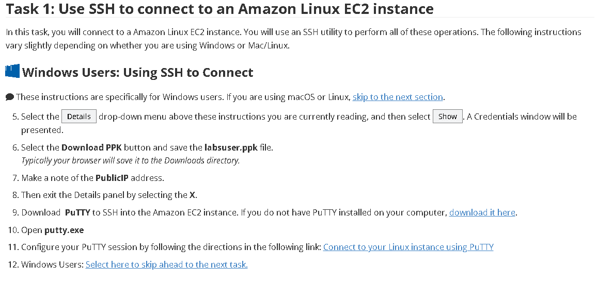
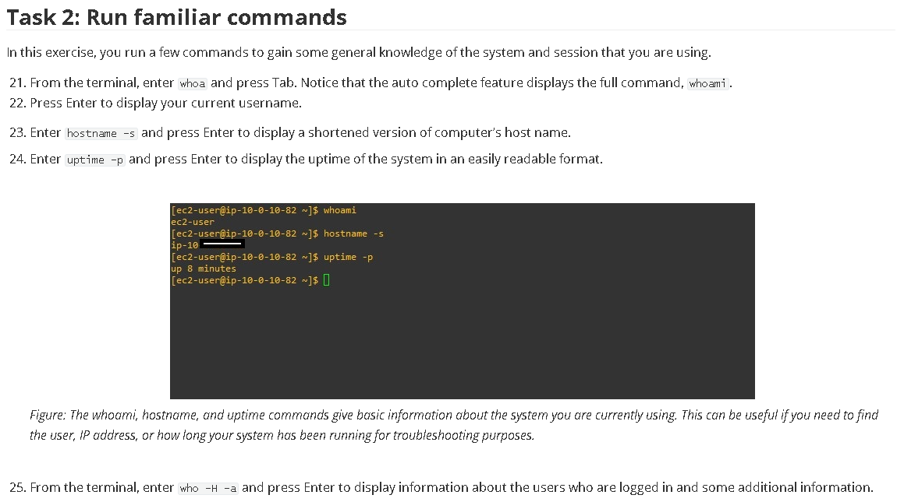

# Linux - 43 modules

Linux is an operating system that is similar to Unix. It is free and open source, and users can expand it.
A Linux distribution combines the Linux kernel with other software applications to provide a complete operating system environment.
All Linux distributions come with a CLI. Some also offer a GUI.
The bashshell is the default shell in Linux.
You can use the man command to read the Linux manual pages.

## Lab 1 

This is just an introduction to Linux CLI using Putty to connect to an EC2 

## Lab 2 - Managing Users and Groups

### Create Users
In this section, you create users based on the following table:

First Name	Last Name	User ID	Job Role	Starting Password
Alejandro	Rosalez	arosalez	Sales Manager	P@ssword1234!
Efua	Owusu	eowusu	Shipping	P@ssword1234!
Jane	Doe	jdoe	Shipping	P@ssword1234!
Li	Juan	ljuan	HR Manager	P@ssword1234!
Mary	Major	mmajor	Finance Manager	P@ssword1234!
Mateo	Jackson	mjackson	CEO	P@ssword1234!
Nikki	Wolf	nwolf	Sales Representative	P@ssword1234!
Paulo	Santos	psantos	Shipping	P@ssword1234!
Sofia	Martinez	smartinez	HR Specialist	P@ssword1234!
Saanvi	Sarkar	ssarkar	Finance Specialist	P@ssword1234!
Ensure that you are spelling the user IDs correctly so that these users can use default credentials to log in.

### Create Groups
In this section you create groups of users and add users to the groups.

Sales
HR
Finance
Personnel
CEO
Shipping
Managers

### Assign Users to the groups created 

To check the group memberships, enter sudo cat /etc/group into the terminal and press Enter.

Sales:x:1014:arosalez,nwolf,ec2-user
HR:x:1015:ljuan,smartinez,ec2-user
Finance:x:1016:mmajor,ssarkar,ec2-user
Shipping:x:1017:eowusu,jdoe,psantos,ec2-user
Managers:x:1018:arosalez,ljuan,mmajor,ec2-user
CEO:x:1019:mjackson,ec2-user

## Lab 3
