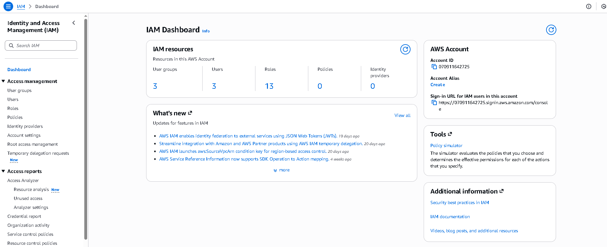
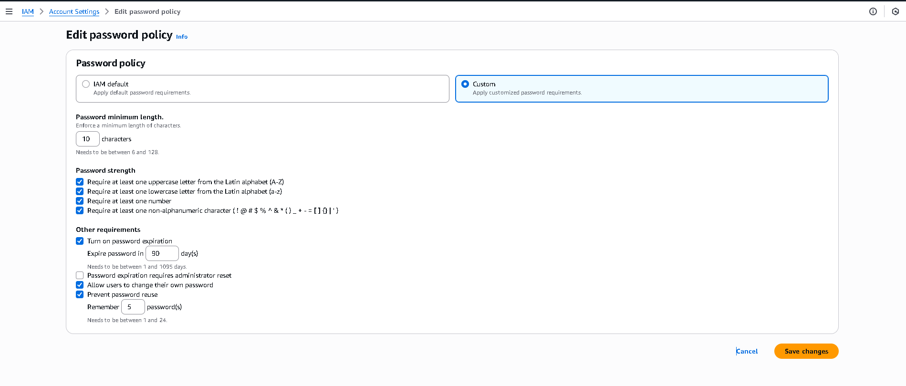
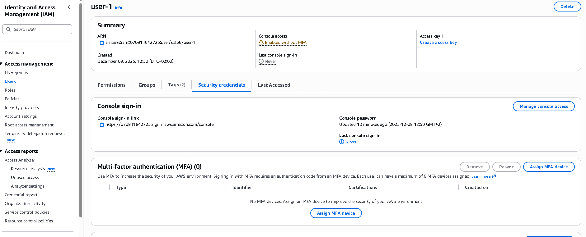
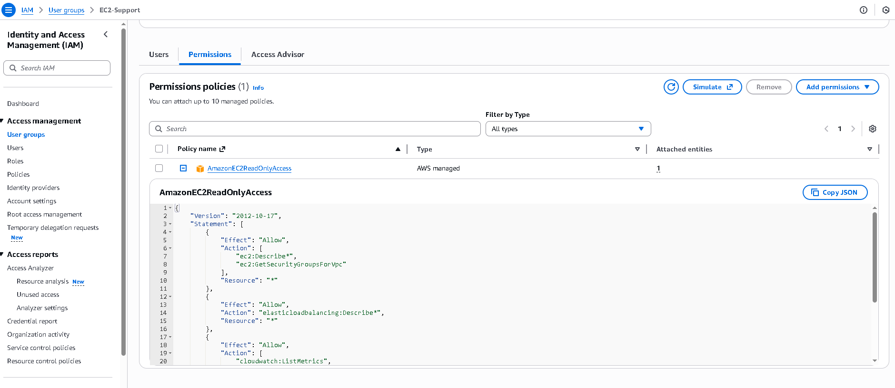
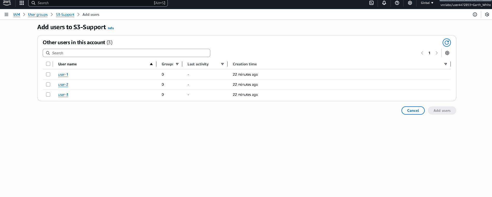

# Introduction to AWS Identity and Access Management (IAM)
In many business environments, access involves a single login to a computer or a network of computer systems that provides the user access to all resources on the network. This access includes rights to personal and shared folders on a network server, company intranets, printers, and other network resources and devices. Unauthorized users can quickly exploit these same resources if the access control and associated authentication procedures are not set up properly.

## In this lab, you will explore users, user groups, and policies in the AWS Identity and Access Management (IAM) service.

Objectives
After completing this lab, you should be able to:

Create and apply an IAM password policy
Explore pre-created IAM users and user groups
Inspect IAM policies as applied to the pre-created user groups
Add users to user groups with specific capabilities active
Locate and use the IAM sign-in URL
Experiment with the effects of policies on service access

## Other AWS services
During this lab, you might receive error messages when performing actions beyond the steps in this lab. These messages will not impact your ability to complete the lab.

# IAM

## IAM can be used for the following:

Manage IAM users and their access: You can create users and assign them individual security credentials (access keys, passwords, and multi-factor authentication devices). You can manage permissions to control which operations a user can perform.
Manage IAM roles and their permissions: An IAM role is similar to a user in that a role is an AWS identity with permission policies that determine what the identity can and cannot do in Amazon Web Services (AWS). However, instead of being uniquely associated with one person, a role is intended to be assumable by anyone who needs it.
Manage federated users and their permissions: You can activate identity federation to allow existing users in your enterprise to access the AWS Management Console, to call AWS application programming interfaces (APIs), and to access resources without the need to create an IAM user for each identity.

## Task 1: Create an account password policy
In this task, you create a custom password policy for your AWS account. This policy affects all the users associated with the account.

First, note the Region that you are in (for example, Oregon). The upper-right corner of the console page displays your Region.

In the AWS Management Console, in the search  box, enter IAM and select it.

In the left navigation pane, choose Account settings.

Here you can see the default password policy that is currently in effect. The company that you are working for has much stricter requirements, and you need to update this policy.

Choose Change password policy.

Under Select your account password policy requirements, configure the following options:

For Enforce minimum password length, change 8 to 10 characters.
Select every check box except the check box for Password expiration requires administrator reset.
For Enable password expiration, leave the default option of 90 days. 
For Prevent password reuse, leave the default option of 5 passwords.
Choose Save changes.

These changes take affect at the AWS account level and apply to every user associated with the account.

## Summary of task 1
In this task, you strengthened the password requirements by creating a custom password policy. The various password options that you selected have now made the passwords that the users create much more difficult to crack.

# Task 2: Explore users and user groups
In this task, you explore the users and user groups that have already been created for you in IAM.

In the left navigation pane, choose Users.

The following IAM users have been created for you:

user-1
user-2
user-3
Choose user-1.

This option bring you to a Summary page for user-1. The Permissions tab is displayed. 

Notice that user-1 does not have any permissions.

Choose the Groups tab.

user-1 is also is not a member of any user groups.

 A user group consists of several users who need access to the same data. Privileges can be distributed to the entire group of users rather than to each individual. This option is much more efficient when applying permissions and provides greater overall control of access to resources than applying permissions to individuals.

Choose the Security credentials tab.

user-1 is assigned a Console password.

In the left navigation pane, choose User groups.

The following user groups have already been created for you:

EC2-Admin
EC2-Support
S3-Support
Choose the EC2-Support group.

This option brings you to the Summary page for the EC2-Support group.

Choose the Permissions tab.

This group has a managed policy associated with it called AmazonEC2ReadOnlyAccess. Managed policies are pre-built policies (built either by AWS or by your administrators) that can be attached to IAM users and user groups. When the policy is updated, the changes to the policy are immediately applied to all users and user groups that are attached to the policy.

Next to the AmazonEC2ReadOnlyAccess policy, select the plus sign to show the policy.

A policy defines what actions are allowed or denied for specific AWS resources. This policy grants permission to list and describe information about Amazon Elastic Compute Cloud (EC2), Elastic Load Balancing (ELB), Amazon CloudWatch, and Amazon EC2 Auto Scaling. This ability to view resources but not modify them is ideal for assigning to a support role.

The following is the basic structure of the statements in an IAM policy:

Effect indicates whether to Allow or Deny the permissions.
Action specifies the API calls that can be made against an AWS service (for example, cloudwatch:ListMetrics).
Resource defines the scope of entities covered by the policy rule (for example, a specific Amazon Simple Storage Service [Amazon S3] bucket, EC2 instance, or * which means any resource).
In the left navigation pane, choose User groups.

Choose the S3-Support group.

Choose the Permissions tab.

The S3-Support group has the AmazonS3ReadOnlyAccess policy attached.

Next to the AmazonS3ReadOnlyAccess policy, select the plus sign to show the policy. 

This policy has permissions to get and list resources in Amazon S3.

In the left navigation pane, choose User groups.

Choose the EC2-Admin group.

Choose the Permissions tab.

This group is slightly different from the other two. Instead of a managed policy, it has a Customer inline policy, which is a policy assigned to only one user or group. Inline policies are typically used to apply permissions for one-off situations.

Next to the EC2-Admin-Policy policy, select the plus sign to show the policy. 

This policy grants permission to view (Describe) information about Amazon EC2 and also the ability to start and stop instances.

## Summary of task 2
In this task, you were able to view pre-created users along with the pre-created user groups. You learned about the attached polices to the user groups and what the differences between the user groups and their permissions are.

Under Actions, choose the Show Policy link.

A policy defines what actions are allowed or denied for specific AWS resources. This policy grants permission to list and describe information about Amazon Elastic Compute Cloud (EC2), Elastic Load Balancing (ELB), Amazon CloudWatch, and Amazon EC2 Auto Scaling. This ability to view resources but not modify them is ideal for assigning to a support role.

The following is the basic structure of the statements in an IAM policy:

Effect indicates whether to Allow or Deny the permissions.
Action specifies the API calls that can be made against an AWS service (for example, cloudwatch:ListMetrics).
Resource defines the scope of entities covered by the policy rule (for example, a specific Amazon Simple Storage Service [Amazon S3] bucket, EC2 instance, or * which means any resource).
To close the Show Policy window, choose the 

In the left navigation pane, choose User groups.

Choose the S3-Support group.

The S3-Support group has the AmazonS3ReadOnlyAccess policy attached.

From the Actions menu, choose the Show Policy link.

This policy has permissions to get and list resources in Amazon S3.

To close the Show Policy window, choose the 

In the left navigation pane, choose User groups.

Choose the EC2-Admin group.

This group is slightly different from the other two. Instead of a managed policy, it has a Customer inline policy, which is a policy assigned to only one user or group. Inline policies are typically used to apply permissions for one-off situations.

Under Actions, choose Show Policy to view the policy.

This policy grants permission to view (Describe) information about Amazon EC2 and also the ability to start and stop instances.

At the bottom of the screen, choose Cancel to close the policy.

## Summary of task 2
In this task, you were able to view pre-created users along with the pre-created user groups. You learned about the attached polices to the user groups and the differences between the user groups and their permissions.

# Task 3: Add users to user groups
You have recently hired user-1 into a role where they will provide support for Amazon S3. You add them to the S3-Support group so that they inherit the necessary permissions via the attached AmazonS3ReadOnlyAccess policy.

 You can ignore any not authorized errors that appear during this task. They are caused by your lab account having limited permissions and should not impact your ability to complete the lab.

Add user-1 to the S3-Support group
In the left navigation pane, choose User groups.

Choose the S3-Support group.

Choose the Users tab.

In the Users tab, choose Add users.

In the Add users to S3-Support window, configure the following options:

Select the check box for user-1.
Choose Add Users.
In the Users tab, you see that user-1 has been added to the group.

Add user-2 to the EC2-Support group
You have hired user-2 into a role where they provide support for Amazon EC2.

Using the previous steps in this task, add user-2 to the EC2-Support group.

user-2 should now be part of the EC2-Support group.

Add user-3 to the EC2-Admin group
You have hired user-3 as your Amazon EC2 administrator to manage your EC2 instances.

Using the previous steps in this task, add user-3 to the EC2-Admin group.

user-3 should now be part of the EC2-Admin group.

In the left navigation pane, choose User groups.

Each group should have a 1 in the Users column for the number of users in each group.

If there is not a 1 beside each group, revisit the previous instructions in this task to confirm that each user is assigned to a group as shown in the table at the beginning of the Business scenario section.

## Summary of task 3
In this task, you added all the associated users to the user groups. 
