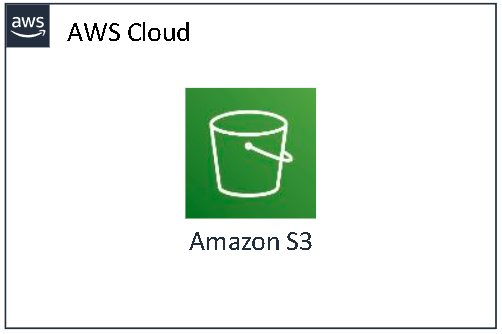
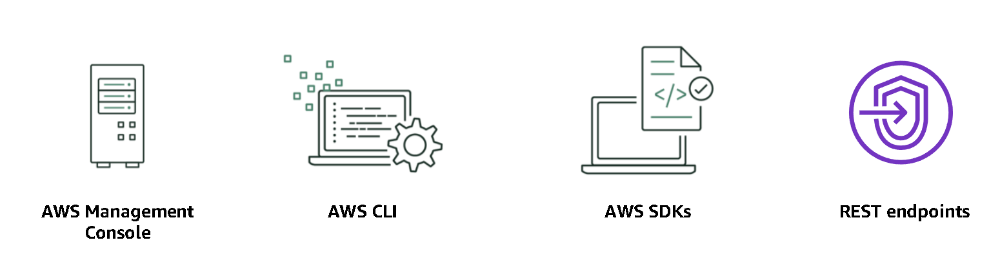
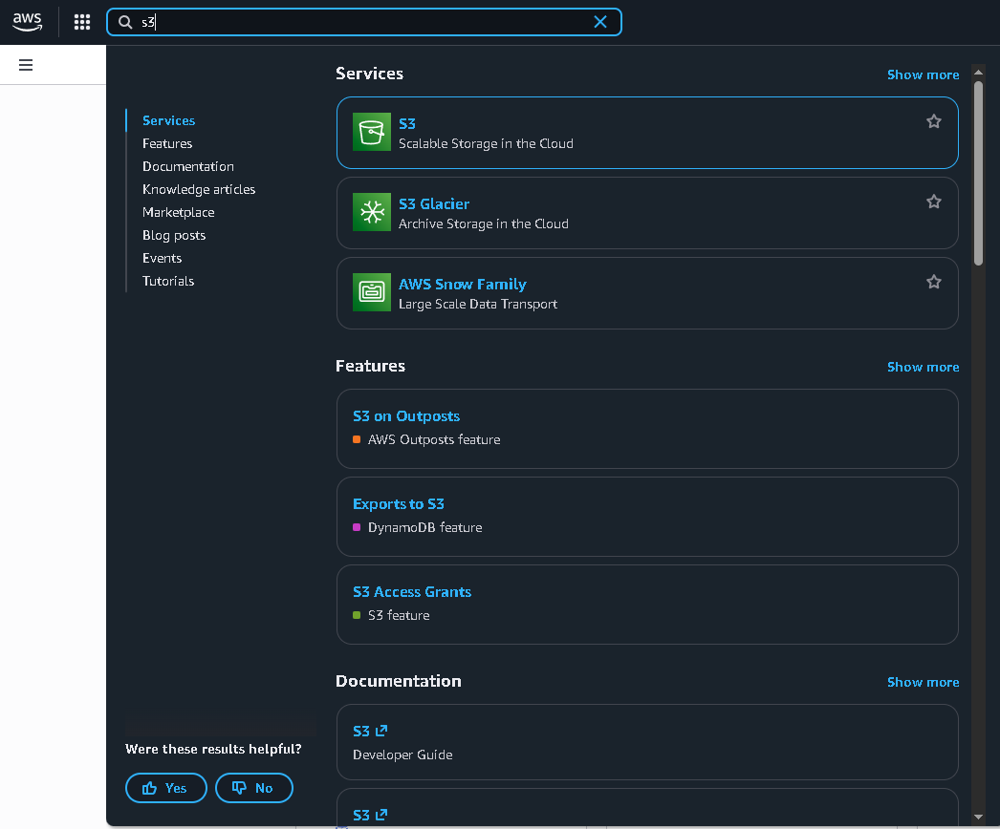
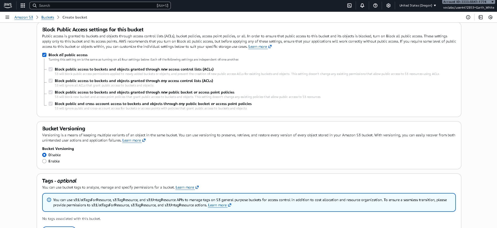
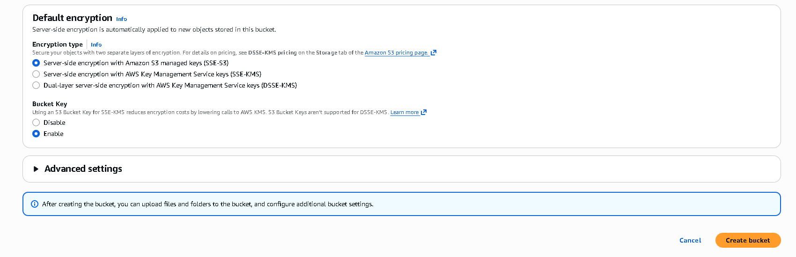

# Amazon S3
## Managed cloud storage solution

Amazon S3 offers a range of object-level storage classes that are designed for different use cases. These classes include the following:

### •Amazon S3 Standard 
Amazon S3 Standard is designed to provide high-durability, high-availability, and high-performance object storage for frequently accessed data. 
Because it delivers low latency and high throughput, Amazon S3 Standard is appropriate for many use cases. 
These use cases include cloud applications, dynamic websites, content distribution, mobile and gaming applications, and big data analytics.

### •Amazon S3 Intelligent-Tiering 
The Amazon S3 Intelligent-Tiering storage class is designed to optimize costs. 
It automatically moves data to the most cost-effective access tier without affecting performance or operational overhead. 
For a small monthly monitoring and automation fee per object, Amazon S3 monitors access patterns of the objects in Amazon S3 Intelligent-Tiering. 
It then moves the objects that haven’t been accessed for 30 consecutive days to the Infrequent Access tier. 
If an object in the Infrequent Access tier is accessed, it is automatically moved back to the Frequent Access tier. 
The Amazon S3 Intelligent-Tiering storage class doesn’t charge retrieval fees when you use it. Also, it doesn’t charge additional fees when objects are moved between access tiers. 
It works well for long-lived data with access patterns that are unknown or unpredictable.

### •Amazon S3 Standard-Infrequent Access (Amazon S3 Standard-IA) 
The Amazon S3 Standard-IA storage class is used for data that is accessed less frequently but requires rapid access when needed. 
Amazon S3 Standard-IA is designed to provide the high durability, high throughput, and low latency of Amazon S3 Standard. With these benefits, it also offers a low per-GB storage price and per-GB retrieval fee. 
This combination of low cost and high performance makes Amazon S3 Standard-IA a good choice for long-term storage and backups. Thus, it also works well as a data store for disaster recovery (DR) files. 

### •Amazon S3 One Zone-Infrequent Access (Amazon S3 One Zone-IA) 
Amazon S3 One Zone-IA is for data that is accessed less frequently but requires rapid access when needed. 
Unlike other Amazon S3 storage classes, which store data in at least three Availability Zones, Amazon S3 One Zone-IA stores data in one Availability Zone. It costs less than Amazon S3 Standard-IA. 
Amazon S3 One Zone-IA works well for customers who want a lower-cost option for infrequently accessed data, but don’t require the availability and resilience of Amazon S3 Standard or Amazon S3 Standard-IA. 
It is a good choice for storing secondary backup copies of on-premises data or easily re-creatable data. 
You can also use it as cost-effective storage for data that is replicated from another AWS Region by using Amazon S3 Cross-Region Replication.

### •Amazon Simple Storage Service Glacier 
Amazon S3 Glacier is a secure, durable, and low-cost storage class for data archiving. You can reliably store virtually any amount of data at costs that are competitive with or cheaper than on-premises solutions.
To keep costs low but suitable for varying needs, Amazon S3 Glacier provides three retrieval options that range from a few minutes to hours. You can upload objects directly to Amazon S3 Glacier. 

### •Amazon S3 Glacier Deep Archive 
Amazon S3 Glacier Deep Archive is the lowest-cost storage class for Amazon S3. It supports long-term retention and digital preservation for data that might be accessed once or twice in a year. 
It is designed for customers, particularly in highly regulated industries, such as financial services, healthcare, and public sectors. 
These customers typically retain datasets for 7–10 years (or more) to meet regulatory compliance requirements. 
Amazon S3 Glacier Deep Archive is a cost-effective and easy-to-manage alternative to magnetic tape systems, whether these tape systems are on-premises libraries or off-premises services. 
All objects that are stored in Amazon S3 Glacier Deep Archive are replicated and stored across at least three geographically dispersed Availability Zones. These objects can be restored within 12 hours.

## Accessability 
You can access Amazon S3 through the AWS Management Console, AWS Command Line Interface (AWS CLI), or AWS Software Development Kits (SDKs).

## Pricing
With Amazon S3, specific costs might vary, depending on the Region and the specific requests that are made. 
You pay for only what you use, including GBs per month; transfer out of other Regions; and PUT, COPY, POST, LIST, and GET requests. As a general rule, you pay for only transfers that cross the boundary of your Region. 
You don’t pay for transfers in to Amazon S3 or for transfers out from Amazon S3 to Amazon CloudFront edge locations in that same Region.

# S3 on AWS

Top right search - S3

# Creating a Bucket

Click on create a bucket. it will ask you whether its to create a GP(General Purpose bucket) or a Dir(directory)
If you need to have the bucket Objects(elements inside the bucket) to be accessible by other teams, enable ACL(Access Control List)

You want to block all public acess as you will be setting up policies if it is going to be used by other parties
Bucket versioning is only if you are going to be working on live enviromental files which will need updating and changes. its so that if something goes wrong you can go back to a version that worked 
Tags are just to add either user groups, commands or security protocols, but if its your first bucket, you wont have any tags.

Lastly its the encryption, this all depends on the level of security access you want on the bucket. 

# S3 Simplified

1. A bucket is basically a cloud folder
2. Just like creating a folder on a local device you create it in the cloud.

